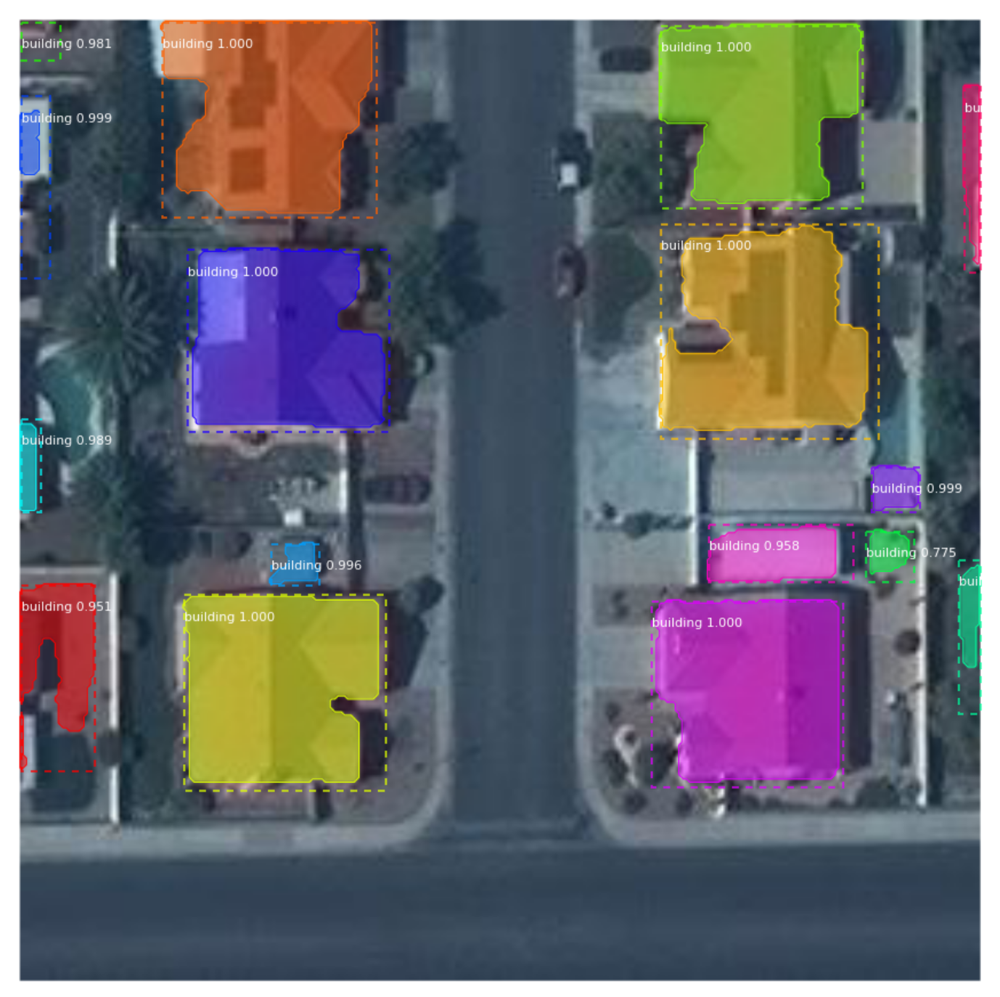

# crowdAI Mapping Challenge : Baseline

This repository contains the details of implementation of the Baseline submission using [Mask RCNN](https://arxiv.org/abs/1703.06870) which obtains a score of `[AP(IoU=0.5)=0.697 ; AR(IoU=0.5)=0.479]` for the [crowdAI Mapping Challenge](https://www.crowdai.org/challenges/mapping-challenge).

# Installation
```
git clone https://github.com/Muneebishere/residential-instance-segmentation.git
cd residential-instance-segmentation
```

Download and move contents to data folder contents from the drive
https://drive.google.com/drive/folders/1vf0iN8-kS_1LdrGDO6Ejq7VZlxcJ5arV?usp=sharing

Ensure docker is installed and run
```
docker build .
```

After docker is built, start docker environment using:
```
docker run -it -p 8888:8888 -p 6006:6006 -v /path-to-current-directory:/data lippoldt331/maskr-cnn bash

```

Change directory to data folder and run notebook
```
jupyter notebook --allow-root
```

# Notebooks
Please follow the instructions on the relevant notebooks for the training, prediction and submissions.

* [Training](Training.ipynb)
* [Prediction and Submission](Testing.ipynb)

# Results



# Acknowledgements
This repository heavily reuses code from the amazing [tensorflow Mask RCNN implementation](https://github.com/matterport/Mask_RCNN) by [@waleedka](https://github.com/waleedka/).
Many thanks to all the contributors of that project.
You are encouraged to checkout [https://github.com/matterport/Mask_RCNN](https://github.com/matterport/Mask_RCNN) for documentation on many other aspects of this code.

# Author
Sharada Mohanty [sharada.mohanty@epfl.ch](sharada.mohanty@epfl.ch)
